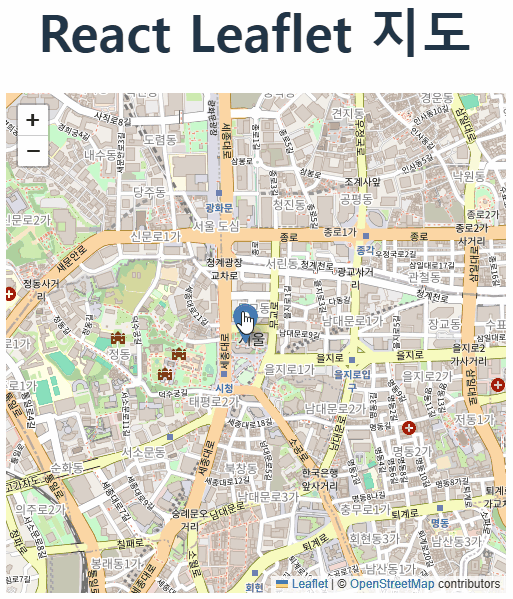

# Leaflet Map Custom

leaflet-map-custom 프로젝트는 React와 Leaflet을 사용하여 지도를 불러오고 커스터마이징하는 기능을 구현한 프로젝트입니다. 이 프로젝트에서는 지도 렌더링과 줌 인/아웃과 같은 기본적인 지도 기능을 다룹니다.

## 🔍 주요 기능

OpenStreetMap 기반의 지도 렌더링
줌 인/아웃 기능
반응형 지도 지원
간단하고 확장 가능한 Leaflet 커스터마이징

## 📷 실행 화면

아래는 지도에서 줌 인/아웃 동작을 보여주는 GIF입니다:

